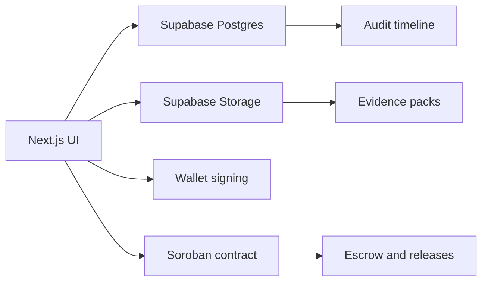

# Milestone Architecture

Milestone is a grant disbursement and accountability platform built on Stellar. The system is designed for programs that need funding control after approval, not just at the application stage.

The product story is: sponsors deposit funds, beneficiaries submit evidence, reviewers release portions of the grant, and the public can inspect a safe audit trail.

## Current Stack Direction

- `Next.js` for the web app and route handlers.
- `Supabase Postgres` for operational state.
- `Supabase Storage` for evidence and public assets.
- `Soroban` for the onchain grant vault contract.
- `Stellar Wallets Kit` or direct wallet integration for Stellar signing.
- `Stellar testnet` for the current product iteration.

## User Roles

- `Sponsor`: creates grants, funds them, and reclaims unused balance.
- `Reviewer`: evaluates evidence, records decisions, and triggers partial releases or pauses.
- `Beneficiary`: receives funds and submits evidence tied to a milestone or review window.
- `Public observer`: can inspect safe grant metadata and release progress without seeing private evidence.

## Responsibility Split

## Onchain / Offchain Split

- Onchain:
  - grant custody
  - release controls
  - pause and resume
  - reclaim unused funds
  - traceability hashes
- Offchain:
  - evidence ingestion
  - basic scoring and review notes
  - dashboard rendering
  - public transparency view
  - delegated GitHub evidence workflow

## Business State Model

- `Draft`: grant exists but is not yet funded or fully activated.
- `Active`: grant can receive evidence and process reviewer decisions.
- `Paused`: the reviewer halted releases due to risk or incomplete proof.
- `Closed`: the grant finished or unused balance was reclaimed.

The operational database mirrors this lifecycle with related records for milestones, evidence packs, evaluations, releases, pause events, and audit events.

## Security Model

- Wallet connection is required for Stellar actions.
- Generic hardcoded credentials remain only as a temporary demo fallback.
- Supabase Auth can come later; it should not block the MVP.
- Public transparency must expose only safe grant fields through views and API responses.

## Current Truth

- The contract lifecycle and database structure are already defined.
- The web product shell and transparency surfaces already exist.
- The main remaining work is wiring the web layer to the database and the deployed Stellar contract.

## Design Principles

- Keep the first release semiautomatic, not autonomous.
- Optimize for a visible, defensible end-to-end demo.
- Make every release explainable by evidence and reviewer override history.
- Avoid extra chain complexity until the Stellar flow is stable.
