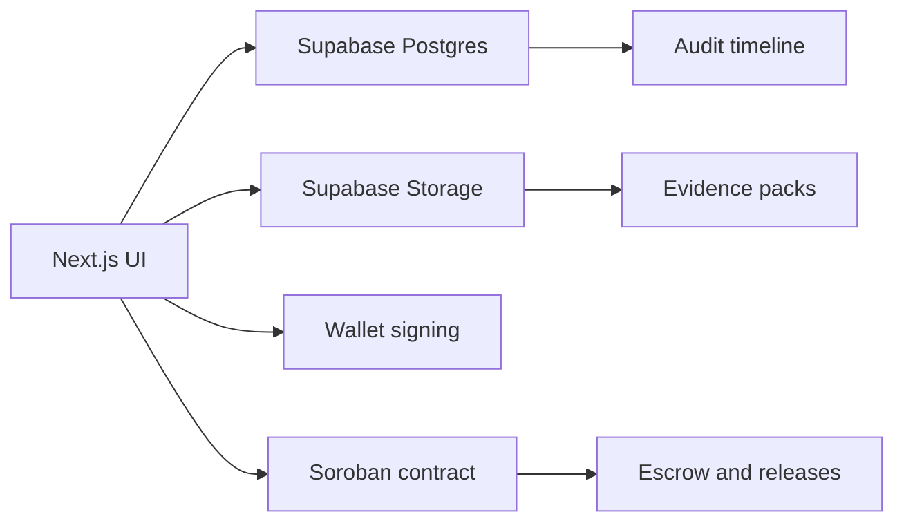

# Milestone Architecture

Milestone is a grant execution platform for Stellar. The product goal is to turn grant funding into a controlled flow of escrow, evidence, release, pause, and audit.

## Current Stack Direction

- `Next.js` for the product UI and API surface.
- `Supabase Postgres` for operational data.
- `Supabase Storage` for evidence and public assets.
- `Soroban` for the onchain vault contract.
- `Stellar Wallets Kit` and wallet providers such as `Freighter` or `Beexo`.
- `Stellar testnet` only for the first implementation.

## Responsibility Split

## Onchain / Offchain Split

- Onchain:
  - grant vault custody
  - release controls
  - pause/resume
  - reclaim unused funds
  - hashes for traceability
- Offchain:
  - evidence ingestion
  - scoring
  - reviewer workflow
  - dashboard rendering
  - public transparency view

## Security Model

- Wallet connection is required for Stellar actions.
- A hardcoded generic user/password path is allowed only for the first iteration so the team can move quickly.
- The database schema is prepared for real auth later, but the auth layer itself should not be overbuilt now.
- Public transparency should expose only grant-safe fields through views.

## Design Principles

- Keep the first release semiautomatic, not autonomous.
- Optimize for a visible end-to-end demo.
- Make every release explainable by score, evidence, and reviewer override history.
- Avoid multichain complexity until the Stellar flow is stable.

