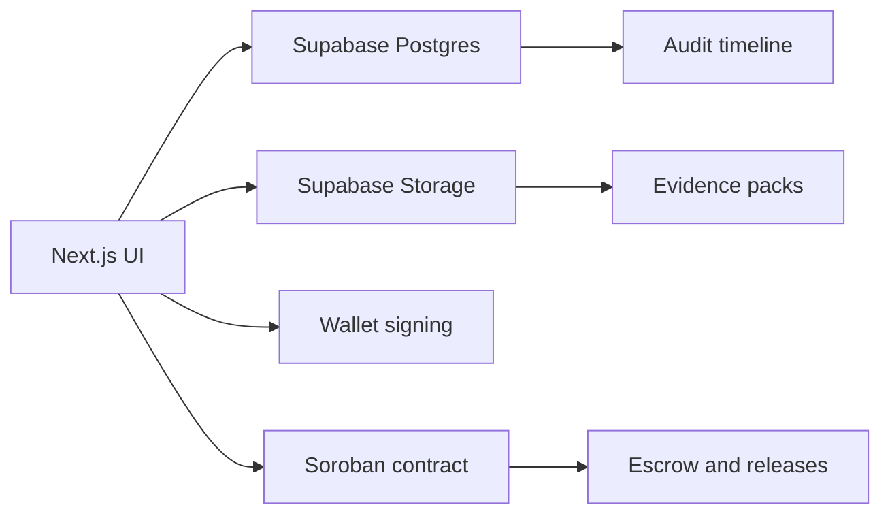

# Milestone Architecture

Milestone is built for the Stellar Hackathon as a simple, defensible story: sponsors deposit funds, beneficiaries submit evidence, reviewers release portions of the grant, and the public can inspect a safe audit trail.

## Current Stack Direction

- `Next.js` for the web app and route handlers.
- `Supabase Postgres` for operational state.
- `Supabase Storage` for evidence and public assets.
- `Soroban` for the onchain grant vault contract.
- `Stellar Wallets Kit` or direct wallet integration for Stellar signing.
- `Stellar testnet` only for the hackathon MVP.

## Responsibility Split

## Onchain / Offchain Split

- Onchain:
  - grant custody
  - release controls
  - pause and resume
  - reclaim unused funds
  - traceability hashes
- Offchain:
  - evidence ingestion
  - basic scoring and review notes
  - dashboard rendering
  - public transparency view
  - validation artifacts for the submission

## Security Model

- Wallet connection is required for Stellar actions.
- Generic hardcoded credentials are acceptable only for the first iteration so the team can ship the demo.
- Supabase Auth can come later; it should not block the MVP.
- Public transparency must expose only safe grant fields through views and API responses.

## Design Principles

- Keep the first release semiautomatic, not autonomous.
- Optimize for a visible end-to-end demo.
- Make every release explainable by evidence and reviewer override history.
- Avoid extra chain complexity until the Stellar flow is stable.
